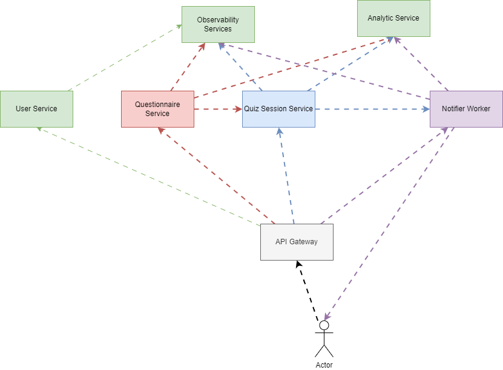
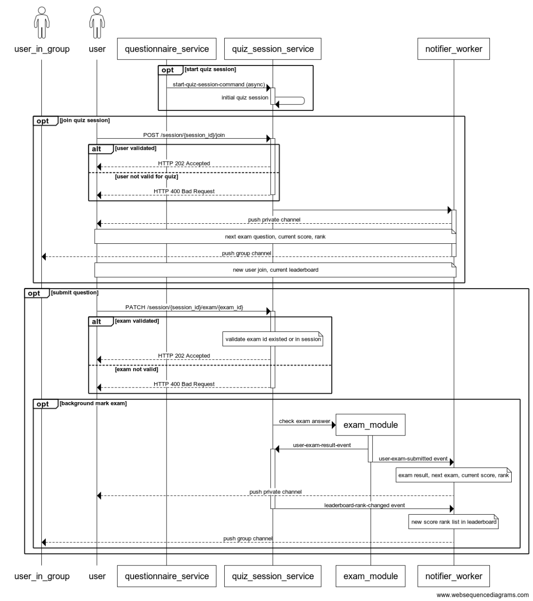

# Quiz System Design

## [High-Level Architecture](./design/architect_selection.md)

## I. Components

### 1. Questionnaire Services

- **Questionnaire Service**: Manages questions for the quiz service. When starting a new quiz session, it selects questions and answers and sends the initial quiz session data to the Quiz Service
  - (assumed to be pre-implemented)
- [**Quiz Session Service**](./design/quiz_session_service.md):
  - Manages the overall quiz session, including leaderboard updates and session state.
  - Handles user interactions during the exam, including answer submission and scoring.
  - This has focus on Domain and business, should apply with DDD vs CQRS. ecommended that should using programming languages like: .NET/Java

### 2. Communication Services

The communication services are responsible for managing notifications and channels:

- [**Notifier Worker Service**](./design/notifier_worker.md)
  - Communicates with users, broadcasting real-time updates such as leaderboard changes.
  - This worker service focus on performance with limit bounded context, it should work as function service, and rarely change, recommended that should using high performance programming language like golang, c++, elixir/erlang...

- **Channel Management Service**: Manages user private channels and group channels, current state of channels, acting as the notification center (assumed to be pre-implemented).

### 3. Analytic Service (assumed to be pre-implemented)

- Captures and analyzes quiz data for analytic using in data flow.
- Should using dynamic language like python, nodejs.
- Recommended that should build this one with python.

### 4. Communication between services

- In this context, the communication between service should run with async, so we should use message broker like Kafka, rabbitMQ, or cloud queue
- Recommended that should using Kafka with scaling on partition.
- In the feature, should apply the service communicate layer with Dapr architect for flexibility in switch between sync and async.

### 5. Database

- For database for event source, should use noSQL database like: MongoDB or EventStore
- For query in short session, with fast and easy in using: use redis as the query database
- The dataflow will take data source in event store and analytic data, then process an ETL flow to Datawarehouse (out-of-scope in this design)

### 6. Observability (assumed to be pre-implemented)

- Logshipper/exporter should design with sidecar architect
- **OpenTelemetry (OTEL)**: Provides tracing and monitoring across all services.
- **APM Server**: Handles application performance monitoring, offering insights into service performance.
- **Logging Stack**: Centralized logging using tools like EFK (Elasticsearch, FluentD, Kibana) stack for aggregating and analyzing logs.

## II. Process Flow

### 1. Create Quiz Session

- The Questionnaire Service sends a `start-quiz-session` command to the Quiz Session Service.
- Quiz Service Initial New Session.

### 2. User Join Quiz Session

- The Quiz Session Service validates the user. If successful, it returns `202 Accepted`; otherwise, it returns `400 Bad Request`.
- Running in the background:
  - Initializes the user exam.
  - Sends notifications to the Notifier Worker:
    - Private Channel (user channel): Next exam, current score.
    - Group Channel (users in the same quiz session channel): New user join, leaderboard ranks.

### 3. User Answer Submission

- User submits an answer to the Quiz Service.
- The service returns `202 Accepted` for asynchronous processing.

### 4. Answer Processing and Scoring

- The Exam Module checks the answer and updates the user's score.

### 5.Event Handling

- The Exam Module raises a `user-submitted-answer-event.
- The `user-submitted-answer-event` event is sent to the Notifier Worker via message bus.
- If the rank of user has changed, the event `user-rank-changed-event` will be raise.
- The Quiz Session Module updates and sorts scores for all users on the leaderboard.

### 6. Leaderboard Update

- After updating and sorting the leaderboard, a `leaderboard-rank-updated-event` event is published to the message bus.

### 7. Notification Broadcasting

- The Notifier Worker handles events and broadcasts the newest leaderboard values to all users in the quiz session.

### 8. Data Analytics

- The Analytic Service captures messages from the message bus for data analysis.

## III. Data Flow

### Event Handling and Background Processing

- User interactions, such as answer submissions, are saved to MongoDB/EventStore as events store in the background to ensure real-time responsiveness.
- Aggregate data, crucial for operations like leaderboard updates, is directly written to Redis for fast read access.

### Re-aggregation for Data Consistency

- Events stored in MongoDB/EventStore are periodically re-aggregated back into Redis to maintain data consistency. 
- This process corrects any temporary inconsistencies that may arise during horizontal scaling or operational peaks.

## [Draw.io](./design/diagrams/quiz-system.drawio)

## [Deployment](./deployment/deployment_testing.md)

## Pros and Cons

### Pros

- **Real-Time Processing**: Ensures responsiveness during high user load by handling save operations asynchronously.
- **Fast Read Performance**: Utilizes Redis for efficient retrieval of aggregated/query data, enhancing performance for critical operations.
- **Event Sourcing**: MongoDB/EventStore as an event store supports event-driven architecture and maintains an audit trail of all changes.
- **Scalability**: Horizontal scaling is feasible, allowing the system to handle increased load and maintain performance.

### Cons

- **Data Consistency**: Potential for temporary inconsistencies in Redis during scaling events, mitigated by periodic re-aggregation.
- **Complexity**: Managing the re-aggregation process adds complexity to ensure correctness and reliability.
- **Performance Overhead**: Background processing and re-aggregation tasks may introduce additional performance considerations under high load.
