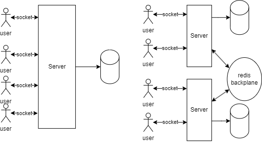
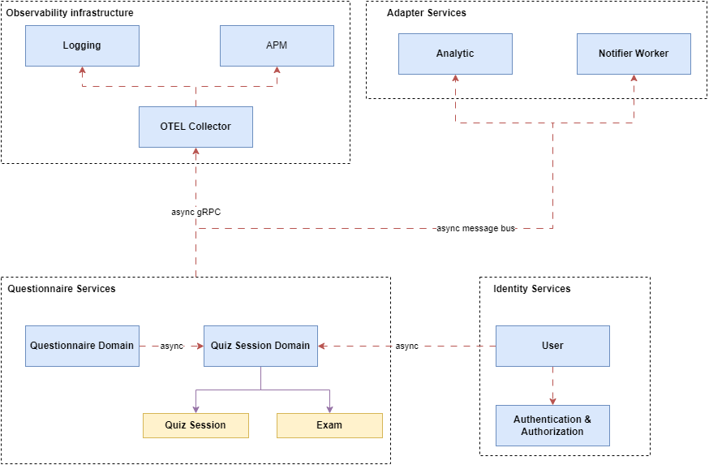

# Architectural Selection

## 1. Monolithic Architecture

- **Real-Time Communication**: Users connect directly to the service via sockets for real-time interactions.
- **Channel Management**: The server manages up to 1000 channels; users in channel 1001 and beyond are managed by other servers.
- **Scalability**: Horizontal scaling involves adding more servers, with Redis used as a backplane for load balancing user channels across servers.

## 2. Microservice Architecture

- **Communication**: Users send HTTP requests to the server, which responds via pusher channels (sockets) for semi-real-time updates.
- **Service Decoupling**: Services are separated, allowing independent scaling and maintenance.
- **Scalability**: Easier horizontal scaling by adding instances of specific microservices as needed.
