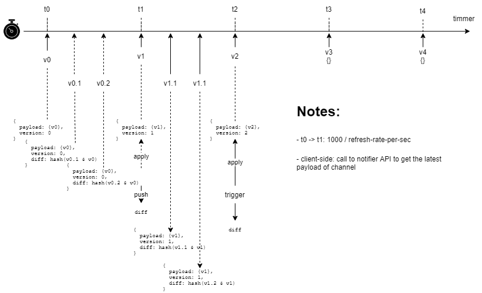

# Notifier Worker process

## Interval Time

- t0 -> t1: 1000 / refresh-rate-per-sec

## Socket Provider implement

Should impl with build-in socket, or with 3rd party streaming push

- web-socket
- RabbitMQ STOMP
- SignalR
- pusher | poxa
- firebase realtime database
- ...

## Payload

To reduce message size and network usage, only the differences between the previous and current versions of the payload should be sent.

## Client-side get state in case that lost connection

call to communication API to get the latest payload of channel.
_If the provider is firebase realtime database or similar, the service already support this_
